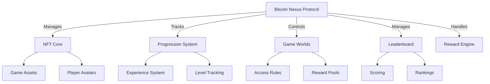

# Bitcoin Nexus Protocol

**Bitcoin Nexus Protocol** is a decentralized gaming infrastructure built on the **Stacks blockchain**, bringing **Bitcoin-grade finality** and **secure NFT-based assets** to interoperable, progression-based gaming experiences.

The protocol provides a modular smart contract system for developers to build games with **cross-world avatars**, **customizable game worlds**, **Bitcoin-backed NFTs**, and **transparent reward mechanics**.

## 🚀 Features

* 🛡️ **Bitcoin-Secured Assets**: All NFTs and game states are anchored to Bitcoin L1 via Stacks.
* 🎮 **Cross-Game Avatars**: Persistent identities with skill progression across multiple worlds.
* 🌐 **Permissioned Game Worlds**: Creators can define access controls, entry fees, and rules.
* 🏆 **Leaderboard & Rewards**: Transparent scoring, on-chain rankings, and BTC/STX-denominated rewards.
* ⚡ **Clarity-Based Smart Contracts**: Secure, verifiable logic using Stacks-native Clarity language.
* 🔐 **Enterprise-Grade Access Control**: Admin whitelists, transfer restrictions, and time-locked updates.

## 🧱 Architecture Overview

```text
+---------------------------+
|      Game Frontends       |
|  (Web / Mobile Clients)   |
+---------------------------+
             |
             v
+---------------------------+       +----------------------------+
|   Clarity Smart Contracts |<----->|     Stacks Blockchain      |
|  (Stacks L2, Bitcoin L1)  |       |   Secured via PoX to BTC   |
+---------------------------+       +----------------------------+
             |
             v
+---------------------------+
|    Bitcoin Nexus Layer    |
+---------------------------+
| - NFT & Avatar Management |
| - Game World Engine       |
| - Progression System      |
| - Leaderboards & Rewards  |
| - Access Control          |
+---------------------------+
```

## 🧩 Core Components

### 🧱 NFT Engine

* `nexus-asset`: NFT game items with metadata (e.g., rarity, power, attributes).
* `nexus-avatar`: Player identity, XP, level, and equipped items.

### 🌍 Game World System

* Creatable via `create-game-world` with name, description, and rules.
* Tracks active players, entry fees, and available rewards.

### 📈 Progression Logic

* Experience thresholds and level caps.
* Equip assets to avatars for enhanced performance.
* Achievements and skill growth.

### 🏆 Leaderboard Engine

* Score submissions and real-time rankings.
* Reward pool bindings for automated prize distributions.
* Player stats tracked on-chain.

### 🛡️ Access Control & Security

* Admin-managed whitelist for minting and critical updates.
* Entry checks for avatars and assets.
* Multi-sig governance & time-locked operations.

## 🧪 Smart Contract Diagram (Mermaid)



---

## ⚙️ Getting Started

### 🧰 Prerequisites

* Node.js 18+
* [Stacks CLI](https://docs.stacks.co) v3.0+
* [Hiro Wallet](https://www.hiro.so/wallet) (testnet)

### 🛠️ Installation

```bash
git clone https://github.com/peter-curl/decentralized-gaming-protocol.git
cd decentralized-gaming-protocol
npm install
```

### 📤 Deployment

```clarity
(initialize-protocol u10 u50)  ;; 10 STX entry fee, 50 leaderboard entries
(create-game-world "DragonRealm" "High fantasy RPG world" u100)
```

## 📚 Key Functions

### 👤 Player Operations

| Function        | Description               | Parameters              |
| --------------- | ------------------------- | ----------------------- |
| `create-avatar` | Initialize player profile | `(name, [world-ids])`   |
| `equip-asset`   | Attach NFT item to avatar | `(avatar-id, asset-id)` |
| `enter-world`   | Access game environment   | `(avatar-id, world-id)` |

### 🔧 Admin Operations

| Function             | Description                 | Parameters                                     |
| -------------------- | --------------------------- | ---------------------------------------------- |
| `mint-nexus-asset`   | Create new NFT game item    | `(name, desc, rarity, power, world-id, attrs)` |
| `update-xp`          | Award experience to avatar  | `(avatar-id, xp-amount)`                       |
| `distribute-rewards` | Trigger reward distribution | `(leaderboard-id)`                             |

---

## ❗ Error Codes

| Code                 | Description                      |
| -------------------- | -------------------------------- |
| `ERR-NOT-AUTHORIZED` | Unauthorized admin action        |
| `ERR-MAX-LEVEL`      | Avatar has hit level cap         |
| `ERR-INVALID-WORLD`  | Target game world doesn't exist  |
| `ERR-ASSET-MISMATCH` | Incompatible asset/world binding |

Example usage:

```clarity
(asserts! (is-valid-name name) ERR-INVALID-NAME)
```

---

## 🔐 Security Model

* **Bitcoin Finality**: All asset transactions settle on Bitcoin L1 through Stacks' PoX consensus.
* **Multi-Sig Governance**: Protocol upgrades gated by multi-signature and timelocks.
* **Input Hardening**: Range checks, strict type assertions, and role-based access restrictions.

---

## 🧪 Testing & Development

Run tests using [Clarinet](https://docs.hiro.so/clarinet):

```bash
clarinet test
```

Covers:

* NFT minting & avatar logic
* XP progression & leveling
* Game world access
* Reward calculation & distribution
* Admin permissions

---

## 🔮 Future Enhancements

* 🔄 Cross-world teleportation & portals
* 🌳 Skill tree systems and attribute-based combat
* ⚔️ PvP arenas with on-chain match logs
* 🧩 BTC-native rewards via DLCs or atomic swaps

---

## 👥 Contributing

1. Fork the repo
2. Create a feature branch (`feat/your-feature`)
3. Write tests for your changes
4. Submit PR — **Security audits are mandatory for core logic**

---

## 🙏 Acknowledgments

* [Stacks Foundation](https://stacks.org)
* [Clarity Language Community](https://clarity-lang.org)
